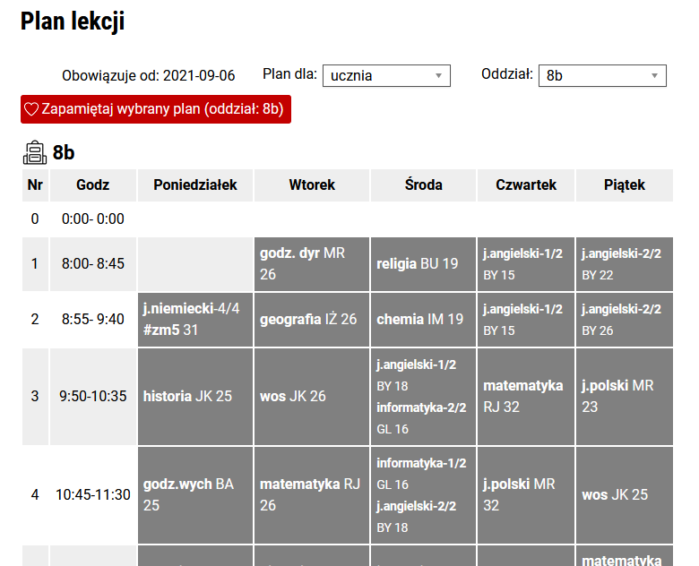
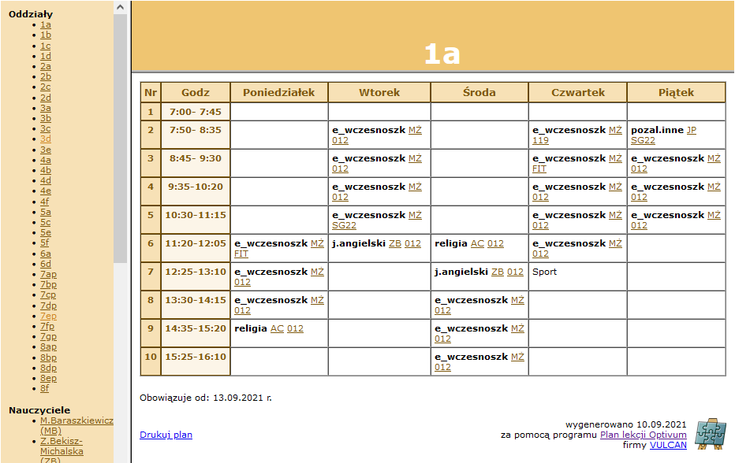

#### LINUX
# VULCAN's Optivum lesson plan
## Checks and notify if change lesson plans.
This is paid plan which buy polish schools at [Vulcan site](https://www.vulcan.edu.pl/programy) to generate lesson plans.

## Config first
Rename config file **plancheckcfg** to prepend with dot and fill with.

### Mail
```
mailssl=
mailsmtp='mailserver:port'
mailfrom='mailfrom@adress'
mailpass='password4mailfrom'
mailto='mailto@adress'
```
mailssl : if no SSL just leave blank

### Styling
htmlstyle : it is preconfigured but if you want change for exp. colors then just edit

### List
```
planlist=("ZS16;https://zs16.edu.bydgoszcz.pl/plan-lekcji?vsel=675&vsel2=;o32"
"ZS16;;o19"
";;o7"
"ZS10;http://zs10.bydgoszcz.pl/html/plany/o4.html"
)
```
Each entry in list consists of 2 to 3 items separated by a semicolon. The first example above is for new api and last is for old api.
Leaving empty field, like in second and third, means use of last value.
To get links for first just copy from adress bar, for last copy link from left panel.

## Get links

**2.0** Just copy from adress bar.




**1.0** Copy link from left panel (left click and Copy Link).



## Install and run
Just put on any linux server or host with shell. Set execute flag on script with **chmod +x**. Set it to run as cron job.

### Args
- -m -> force send mail
- -u -> just update and no sending mail.